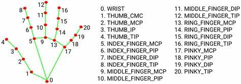

# OpenCV + MediaPipe 手勢音量控制

本專案紀錄使用 OpenCV + MediaPipe 進行手勢音量追蹤


## Open Camera and OpenCV

```python
    def liveStream(self):
        # Open webcam for live streaming
        cap = cv2.VideoCapture(0)
        cap.set(cv2.CAP_PROP_FRAME_WIDTH, self.w)
        cap.set(cv2.CAP_PROP_FRAME_HEIGHT, self.h)

        # Initialize MediaPipe Hands module
        with self.mpHands.Hands(
            min_detection_confidence=self.min_detection_confidence,
            min_tracking_confidence=self.min_tracking_confidence,
            max_num_hands=self.num_hands,
        ) as hands:
            while cap.isOpened():
                success, frame = cap.read()
                if not success:
                    print("Empty frame.")
                    continue

                # Process frame with MediaPipe Hands
                frame = cv2.cvtColor(frame, cv2.COLOR_BGR2RGB)
                frame = cv2.flip(frame, 1)
                result = hands.process(frame)
                frame = cv2.cvtColor(frame, cv2.COLOR_RGB2BGR)
```

OpenCV 預設的影像格視為 BGR，在處理每禎影像的手部動態追蹤時，我們必須先將影像轉換為 RGB 格式，得到結果後就需要轉回 BGR 來應用到後續的 OpenCV 設置

另外，為了方便閱讀，我們可以將影像鏡像 ```frame = cv2.flip(frame, 1)```，不然左右顛倒的畫面看起來很難受

## Volume calculation

在音量計算中有幾個重點

1. 如何定義音量的計算方法
2. 如何設置音量

### How to calc volume?

MediaPipe 獲取的手部位置追蹤圖如下



我們採用單手食指到大拇指間的距離作為音量控制，也就是點 4 與 點 8 之間的距離，這種計算方式會面臨兩個問題

1. 相對於相機的遠近會影響距離
2. 每個人手大小不一，食指到大拇指間的距離也不一

#### Eliminate camera deep influence

為了消除相機深度帶來的影響，我們思考一下:

當我們的手在相機中的 z 軸前後運動時，食指與大拇指會根據 z 軸的距離產生變化，因此，我們必須找到一個也會等比例變化的基準作為比對，當我們對兩者取比值，就可以消除深度帶來的影響啦

筆者就簡易的使用點 0 與點 1 之間的距離作為基準，可以想像的是距離相機距離產生變化，雖然點 4 與點 8 會產生變化，但是點 0 與點 1 也會相對產生變化，而且這兩個變化理論上來講是等比例的，因此當我們計算兩者比值便可忽略深度所帶來的影響

```python
                if result.multi_hand_landmarks:
                    for handLms in result.multi_hand_landmarks:
                        # Draw hand landmarks and connections
                        self.mpDraw.draw_landmarks(
                            frame,
                            handLms,
                            self.mpHands.HAND_CONNECTIONS,
                            self.mpDrawStyle.get_default_hand_landmarks_style(),
                            self.mpDrawStyle.get_default_hand_connections_style(),
                        )

                        # Extract hand landmarks for volume control
                        landmarks = [(lm.x * self.w, lm.y * self.h) for lm in handLms.landmark]
                        dist = ((landmarks[4][0] - landmarks[8][0]) ** 2 + (landmarks[4][1] - landmarks[8][1]) ** 2) ** .5
                        middle = ((landmarks[4][0] + landmarks[8][0]) / 2, (landmarks[4][1] + landmarks[8][1]) / 2)
                        # Set a landmark for camera deep ratio control
                        mark = ((landmarks[0][0] - landmarks[1][0]) ** 2 + (landmarks[0][1] - landmarks[1][1]) ** 2) ** .5

                        # Visualize key points
                        cv2.circle(frame, (int(landmarks[4][0]), int(landmarks[4][1])), 10, (255, 0, 255), -1)
                        cv2.circle(frame, (int(landmarks[8][0]), int(landmarks[8][1])), 10, (255, 0, 255), -1)
                        cv2.circle(frame, (int(middle[0]), int(middle[1])), 10, (255, 0, 255), -1)
                        cv2.line(frame, (int(landmarks[4][0]), int(landmarks[4][1])),
                                 (int(landmarks[8][0]), int(landmarks[8][1])), (255, 0, 255), 5)

                        # Calculate volume based on hand movements
                        ratio = dist / mark
```

#### Eliminate instance difference

這部分筆者還未想到一個有效率的方案，因此，在設計之前，筆者先計算了筆者大拇指到食指之間距離比值的最大值與最小值，分別是 0.3 和 2.5，並將這個區間 [0.3, 2.5] 映射到音量範圍 [0, 100]

```python
                        low, high = 0.3, 2.5
                        vol = np.clip((ratio - low) / (high - low), 0, 1) * 100

                    # Display volume indicator
                    cv2.rectangle(frame, (rctW, rctH), (rctW + 25, rctH + 100), (255, 0, 0), 3)
                    cv2.rectangle(frame, (rctW, rctH + 100 - int(vol)), (rctW + 25, rctH + 100), (255, 0, 0), -1)
                    cv2.putText(frame, f"vol: {int(vol)}", (rctW - 20, rctH - 30), cv2.FONT_HERSHEY_SIMPLEX, 1,
                                (255, 0, 0), 3)
```

### Terminate condition

當我們決定音量之後，就要設置一個終止條件，這個部分就有很多方案了，點頭，手勢等等都可以，筆者這裡就用一個簡單的判斷來作為終止條件

當音量變化不大時 (也就是手勢固定)，我們就終止控制音量的過程

```python
                    # Check for significant volume change and terminate
                    volDiff = vol - pVol
                    if volDiff < self.vol_diff:
                        Time += time.time() - pTime
                        if Time > self.check_time:
                            return
                    else:
                        Time = 0
                    pVol = vol
```

### How to set volume?

我們採用 pycaw 的方式透過 python API 控制音量

首先我們必須知道 python 音量的映射範圍，筆者電腦的範圍是 [-45, 0]，我們要將 [0, 100] 映射到 [-45, 0]，然而，對於每一台計算機而言，映射方法都不同，而這些映射方法通常是非線性的 (對數函數)。對於筆者而言，我本機的映射方法為

```python
b = 0.04035360699999999
c = 32.278481179064414
np.log10(max(vol / 100, b)) * c
```

其中

- `b:` 控制對數函數在零點不會收斂的問題
- `c:` 控制映射過程的參數

透過上述函數，我們就可以把 vol 確切的數值映射到本機的音量

```python
    @property
    def getVolume(self):
        # Get audio volume controls using pycaw
        devices = AudioUtilities.GetSpeakers()
        interface = devices.Activate(IAudioEndpointVolume._iid_, CLSCTX_ALL, None)
        volume = cast(interface, POINTER(IAudioEndpointVolume))

        # Get volume range
        vmin, vmax, vinc = volume.GetVolumeRange()
        return volume, vmin, vmax

        .....

                    # Set the system volume based on hand movement
                    self.volume.SetMasterVolumeLevel(np.log10(max(vol / 100, bot)) * c, None)
```

全部代碼詳見 ```main.py```